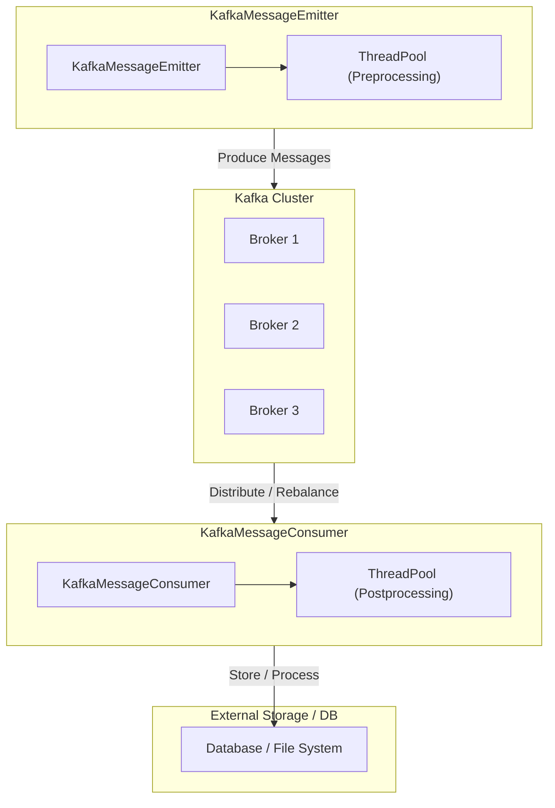

# CPP_KafkaSample
모던 C++을 사용하여 카프카에 대한 기술 시연을 구현합니다.
MSA 컨셉으로 스케일 아웃 상황을 가정하여 시연합니다.

### 요약
- **포트폴리오 기본 구조**:
    1. **`KafkaMessageEmitter`**: 고성능 Producer (ThreadPool로 메시지 생성), 카프카 전송
    2. **`KafkaMessageConsumer`**: 메시지를 병렬로 받아 ThreadPool로 후처리
- **스케일 아웃**:
    - “토픽 파티션”과 “클러스터 노드”를 늘리면, **Producer**와 **Consumer**를 병렬로 확장할 수 있다.
    - Consumer Group이 늘어나면 파티션 리밸런싱(Rebalance)로 고성능 처리.
- **추가 요소**:
    - 에러 콜백, TLS/SASL, Rebalance callback, Batch 처리, 모니터링, 트랜잭션 등.
    - 이를 포함하면 “대형 기업 환경에서도 요구되는 주요 기능”을 시연 가능.

### 기본 구성

